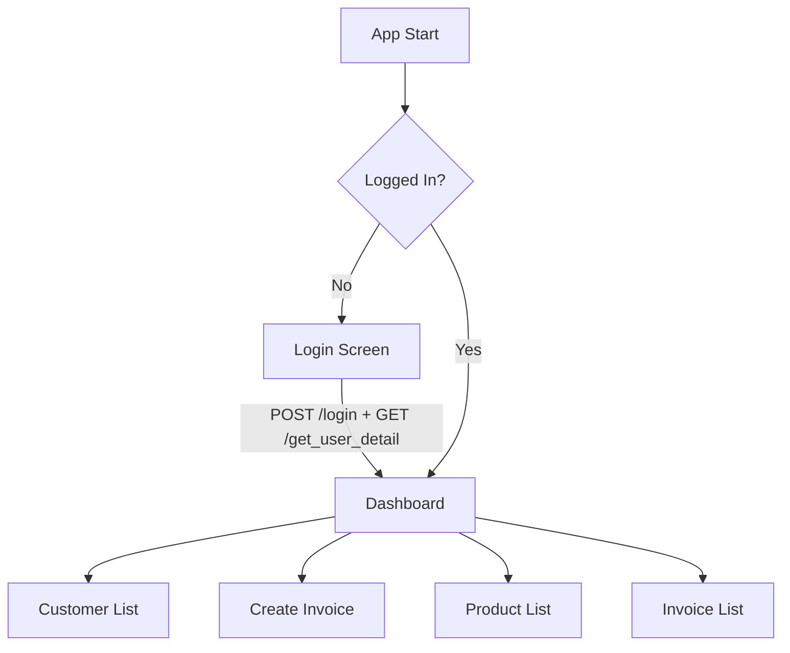
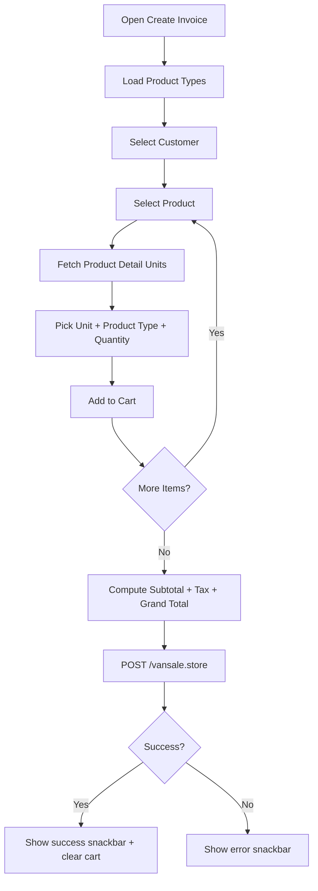

# Van Sales Flutter App

Production-style Flutter implementation of a van-sales workflow with live backend APIs.

This project is interview-focused and demonstrates:
- Accurate API integration
- Clean code structure and modularity
- End-to-end application flow
- Practical error handling
- User-friendly mobile UI/UX

## Table of Contents
- [1. Project Overview](#1-project-overview)
- [2. Key Features](#2-key-features)
- [3. Tech Stack](#3-tech-stack)
- [4. Architecture](#4-architecture)
- [5. Folder Structure](#5-folder-structure)
- [6. Application Flow](#6-application-flow)
- [7. API Integration](#7-api-integration)
- [8. Core Code Walkthrough](#8-core-code-walkthrough)
- [9. Error Handling Strategy](#9-error-handling-strategy)
- [10. UI/UX Notes](#10-uiux-notes)
- [11. Setup & Run](#11-setup--run)
- [12. Build for Release](#12-build-for-release)
- [13. Interview Evaluation Mapping](#13-interview-evaluation-mapping)
- [14. Security Measures](#14-security-measures)
- [15. Known Limitations / Future Improvements](#15-known-limitations--future-improvements)

## 1. Project Overview
The app simulates a field sales executive workflow:
1. Login
2. Load user context (route/van/store)
3. Browse/select customers
4. Browse/select products with unit + product type + quantity
5. Create invoice (van sale)
6. View invoice history

The app uses a central `AppSession` for auth/session state and an `ApiClient` for all network communication.

## 2. Key Features
- Authentication with token handling
- Session bootstrap via user detail API
- Customer listing with search and pull-to-refresh
- Product listing with search, product details, and selectable mode
- Product selection with unit pricing and product type mapping
- Invoice creation with:
  - item aggregation (same product + same unit merged)
  - subtotal/tax/grand-total calculations
  - backend payload serialization
- Invoice history screen with pull-to-refresh
- Retry-first error UX across all network-heavy screens

### Security-Oriented Features
- Bearer token-based authenticated API access after login
- Centralized header management to avoid inconsistent auth handling
- Session guard clauses to prevent protected actions when user/session data is missing
- Defensive response parsing with explicit exception throws on malformed responses
- UI-level input validation before network submission
- Controlled error-message rendering (strips raw `Exception:` prefix for cleaner output)

## 3. Tech Stack
- Flutter (Material 3)
- Dart SDK `^3.11.0`
- `http` for REST API calls
- `intl` for currency/number formatting
- `flutter_lints` for static analysis conventions

## 4. Architecture
The app follows a clean, lightweight layered structure:

- `ui` layer: screens and user interactions
- `app` layer: session and auth lifecycle
- `data` layer: API client + strongly typed models

State management is intentionally simple:
- `AppSession extends ChangeNotifier`
- Root widget listens via `AnimatedBuilder`
- App switches between `LoginScreen` and `DashboardScreen` based on session state

## 5. Folder Structure
```text
lib/
  main.dart                       # App entry point and MaterialApp setup
  app/
    app_session.dart              # Auth/session state and login/logout orchestration
  data/
    api_client.dart               # All HTTP calls + response validation
    models.dart                   # Domain models (User, Customer, Product, Invoice, Cart)
  ui/
    screens/
      login_screen.dart           # Login form + validation + submit states
      dashboard_screen.dart       # Main navigation hub
      customer_list_screen.dart   # Customer browse/search/select
      product_list_screen.dart    # Product browse/search + detail modal/selection
      select_product_screen.dart  # Unit/type/qty selection
      create_invoice_screen.dart  # Invoice composition + submission
      invoice_list_screen.dart    # Invoice history

test/
  widget_test.dart                # Basic smoke test for login UI
```

## 6. Application Flow
### 6.1 High-Level Navigation


### 6.2 Invoice Creation Flow


## 7. API Integration
Base URL in code:
`http://142.93.214.133:3641/api`

### 7.1 Endpoints Used
| Method | Endpoint | Purpose | Used In |
|---|---|---|---|
| POST | `/login` | Authenticate user and get token | `AppSession.login` |
| GET | `/get_user_detail` | Load route/van/store context | `AppSession.login` |
| GET | `/get_customer` | Fetch customer list by route/store | `CustomerListScreen` |
| GET | `/get_product` | Fetch products for store | `ProductListScreen` |
| GET | `/get_product_type` | Fetch product type options | `CreateInvoiceScreen` |
| GET | `/get_product_detail` | Fetch product unit-price details | `SelectProductScreen` |
| POST | `/vansale.store` | Submit invoice payload | `CreateInvoiceScreen` |
| GET | `/vansale.index` | Fetch invoice history | `InvoiceListScreen` |

### 7.2 Integration Notes
- `ApiClient._assertSuccess` validates both HTTP status and API-level success flags.
- Token is automatically injected in `Authorization: Bearer <token>` after login.
- Request/response parsing is model-driven to reduce runtime casting errors.
- Screen-level loading and retry states are implemented around every major network call.

## 8. Core Code Walkthrough
### 8.1 App Entry and Session-Driven Routing
- `main.dart` creates a single `AppSession`.
- `AnimatedBuilder` rebuilds the app when session auth state changes.
- Home route toggles between login and dashboard.

### 8.2 Session Management
`app/app_session.dart`:
- `login()` performs:
  1. `POST /login`
  2. token extraction and persistence in memory
  3. `GET /get_user_detail` bootstrap
  4. `notifyListeners()` to refresh root UI
- `logout()` clears user/token/detail and notifies listeners.

### 8.3 API Client
`data/api_client.dart`:
- Centralized HTTP layer (`_get`, `login`, `createVanSale`, etc.)
- JSON decoding guardrails (`_decode`)
- Unified success/failure checks (`_assertSuccess`)
- Explicit payload mapping for invoice submission arrays:
  - `item_id`, `quantity`, `mrp`, `product_type`, `unit`

### 8.4 Domain Models
`data/models.dart` includes:
- `AppUser`, `UserDetail`, `Customer`
- `Product`, `ProductUnit`, `ProductType`
- `CartItem` with computed getters:
  - `lineTotal`
  - `lineTax`
  - `lineGrandTotal`
- `VanSale` for invoice listing

### 8.5 Invoice Calculation Logic
`create_invoice_screen.dart`:
- Subtotal: sum of `item.lineTotal`
- Tax: sum of `item.lineTax`
- Grand Total: subtotal + tax
- Same product+unit pairs are merged by increasing quantity to avoid duplicate lines.

## 9. Error Handling Strategy
Error handling is implemented at three levels:

1. Input validation
- Login form enforces required email/password.
- Invoice submission enforces selected customer and at least one item.

2. API/transport errors
- Non-2xx responses and API-level failures throw explicit exceptions.
- Exceptions are surfaced as user-readable messages.

3. UX recovery patterns
- Retry buttons on data-loading screens
- `SnackBar` messages for transient actions (submit failures, validation misses)
- Progress indicators and disabled actions during async operations

## 10. UI/UX Notes
- Material 3 with consistent color seed and spacing
- Clear task-oriented dashboard navigation
- Search UX in customer/product lists
- Pull-to-refresh for list synchronization
- Bottom sheet for quick product detail inspection
- Contextual feedback:
  - loading indicators
  - inline error blocks + retry CTA
  - success/failure snackbars
- Mobile-friendly forms and constrained login width for readability on larger screens

## 11. Setup & Run
### Prerequisites
- Flutter SDK installed
- Dart SDK compatible with `^3.11.0`
- Device/emulator configured

### Run
```bash
flutter pub get
flutter run
```

## 12. Build for Release
```bash
flutter build apk --release
```

Generated APK:
`build/app/outputs/flutter-apk/app-release.apk`

## 13. Interview Evaluation Mapping
### API Integration Accuracy
- All required assignment APIs are integrated and wired to real UI flows.
- Endpoint-specific request parameters are passed from authenticated session/user context.
- Invoice payload maps computed client data into backend schema fields.

### Code Quality & Structure
- Separation of concerns: UI vs session vs data layers.
- Reusable typed models reduce dynamic parsing issues.
- Lint-ready project (`flutter_lints`) and consistent async patterns.

### UI/UX Design
- Clean Material UI with discoverable navigation.
- Search, refresh, loading, and retry patterns increase usability.
- Inline validation and contextual feedback improve task completion.

### Application Flow & Logic
- Login bootstraps required business context (route/store/van).
- Invoice flow enforces dependencies in order: types -> customer -> products -> totals -> submit.
- Aggregation and total calculations are deterministic and transparent.

### Error Handling
- Guard clauses for missing session/customer/items.
- API and transport errors are normalized into user-friendly messages.
- Retry mechanisms available in all major data fetching screens.

## 14. Security Measures
This project applies practical client-side security controls appropriate for a Flutter interview assignment:

1. Authenticated API calls
- Uses token-based auth (`Authorization: Bearer <token>`) for protected endpoints.
- Token is set only after successful login and cleared on logout.

2. Session integrity checks
- Critical flows (customer load, invoice submit, invoice list) validate that required session context exists (`user`, `userDetail`, token lifecycle).
- Prevents unintended API calls with incomplete identity/route/store state.

3. Input validation and request hardening
- Login blocks empty credentials.
- Invoice submission blocks invalid business states (no customer/no items/session expired).
- API payloads are generated from typed values, reducing malformed request risk.

4. Response validation and fail-fast behavior
- API responses pass through centralized decode + success assertion.
- Non-2xx and API-level failures are converted into explicit exceptions and surfaced safely.

5. Reduced data exposure in UI
- Error handling shows concise, user-friendly failure messages instead of verbose internal traces.
- Session reset (`logout`) clears in-memory user and token references.

6. Secure-by-next-step recommendations
- Planned enhancement: move token from in-memory storage to secure storage (e.g., Keychain/Keystore via `flutter_secure_storage`).
- Planned enhancement: enforce HTTPS-only API base URL in production.
- Planned enhancement: add SSL pinning for higher-assurance transport security.

## 15. Known Limitations / Future Improvements
- Token persistence is in-memory only; can be extended via secure local storage.
- No offline-first caching strategy yet.
- No pagination for large datasets.
- Product inventory/stock-level field is not currently modeled in this client.
- Expand automated tests:
  - API client unit tests
  - Widget tests for invoice creation flow
  - Error state regression tests
